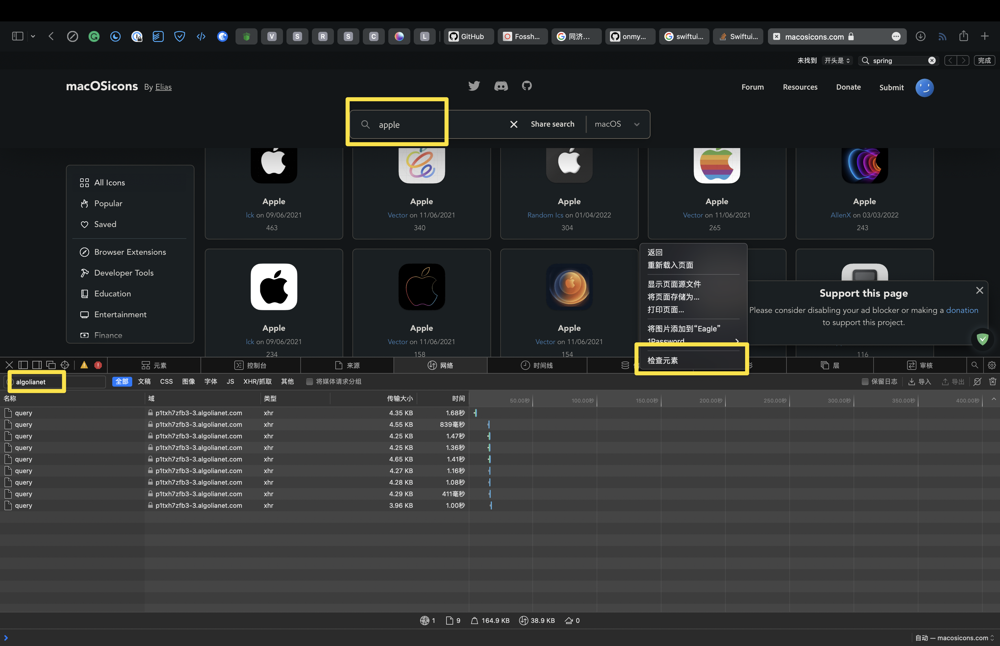

# IconChanger

IconChanger is an app that can change you app's icon. It simplifies your icon changing process.
  

## How to use

1. Go to github release
2. Download the latest app

## How to get query api (optional)

1. Open safari
2. Open https://macosicons.com/#/
3. search anything
4. Open devloper tool
5. Choose network tab
6. Search `algolianet`
7. Copy host like `p1txh7zfb3-3.algolianet.com`
8. Open IconChanger Setting
9. Input the host.

## About System App

Vert sorry to tell, but currtely we cannot change the icon of System Apps. Because of the SIP, users or root cannot write things to this kind of apps. And the idea of Bridge App need to change the `Info.plist`, so it will not work.

## How to contribute

1. Fork the project
2. Download the fork
3. Open it in the xcode (>13.3)
4. Start contibution

## Acknowledgement

* [macOSIcon](https://macosicons.com/#/)
* [fileiocn](https://github.com/mklement0/fileicon)
